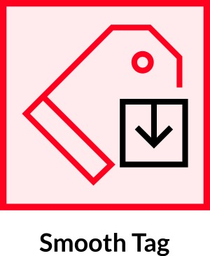
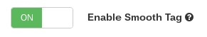
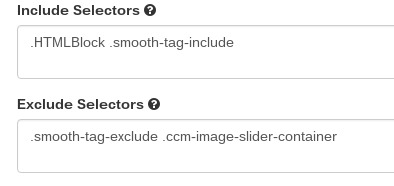

    

<h4 align="center">
    Smooth Tag <i>is a Concrete5 add-on</i>
</h4>

    Installing this plugin will make anchor links animate to position on the screen instead of jumping to them.

<article class="markdown-body">
    <h1>Introduction</h1>
    
Installing this plugin causes the smoothTag.js file to be loaded into the footer on all non-admin pages.  It can be enabled or disabled from its dashboard page.

    <h2>Settings</h2>
    

        You may enable or disable the plugin from here:
    

    
    
Smooth Tag works by executing whenever an anchor link on a page is clicked.  Other plugins may also make use of anchor links for different functionality such as changing a slide in a slideshow or switching through different tabs of content in a block that does such a thing.

    
<b>Therefore Smooth Tag needs to ignore certain elements that may cause conflicts.</b>

    
Smooth Tag will excplicitly ignore anchor links contained within the classes or id's listed in the 'Exclude Selectors' text area below, and similarily, it will act upon any anchor links contained within the selectors listed in the 'Include Selectors' text area.

    
You can utilize both include and exclude selectors.  By default we've listed known selectors for Smooth Tag to ignore, and you may add more if you need.

    
If you had a FAQ page with lots of anchor links you wanted to animate, but have the plugin ignore anything else on the site, then simply add a class name or id that contains all the FAQs anchor links.

    
<b>If no include selectors are given, Smooth Tag will run on any anchor links not contained within one of the exclude selectors.</b>

    
    

        To get the plugin working with the most minimal configuration, simply removed the include selectors that are listed by default, and the plugin will target everything not explicitly being told to exclude.
    

</article>
